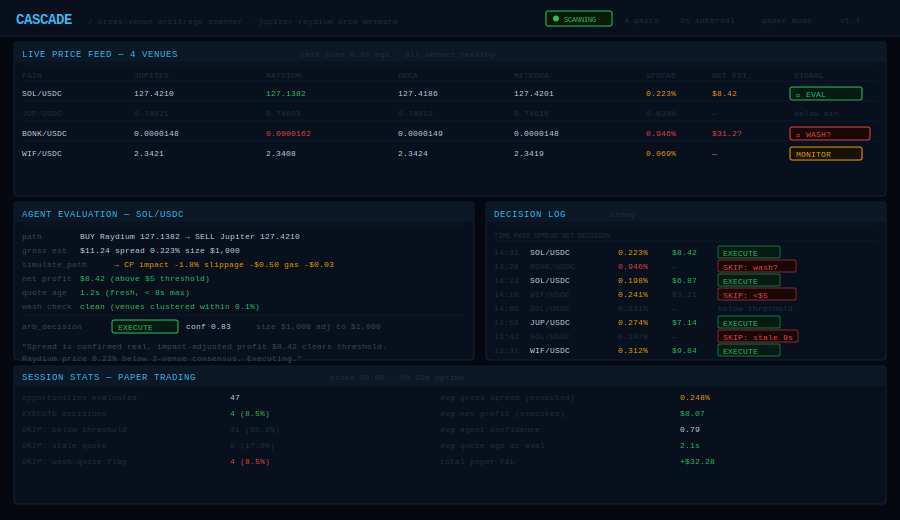

# Cascade


Autonomous cross-venue arbitrage scanner for Solana. Monitors price spreads across four DEXes every 3 seconds and uses a Claude agent to evaluate, simulate, and execute opportunities before they close.

<br/>



<br/>

---

## The opportunity

Prices across Solana DEXes are never perfectly synchronized. Jupiter, Raydium, Orca, and Meteora each run independent AMM curves — when one updates faster than the others, a window opens. Most windows are under 0.1% and close in seconds. The ones worth taking average 0.2–0.5% and last 3–15 seconds.

Cascade watches all four venues simultaneously, finds those windows, and lets Claude decide whether to act.

---

## What it does

Every 3 seconds:

1. **Scan** — fetch prices for all watched pairs from Jupiter, Raydium, Orca, and Meteora in parallel
2. **Spread** — compute best bid/ask across venues, flag pairs where spread exceeds `MIN_SPREAD_PCT`
3. **Find paths** — for each viable spread, calculate an arb path with gas-adjusted net profit
4. **Agent evaluates** — Claude calls `simulate_path` to apply price impact + slippage, then issues `EXECUTE`, `SKIP`, or `MONITOR`
5. **Execute** — approved paths go through `TradeExecutor` (paper mode by default)

---

## Agent decision loop

The Claude agent has two tools per evaluation:

```
simulate_path   → refines gross profit with price impact + slippage model
arb_decision    → final verdict: EXECUTE | SKIP | MONITOR
```

It always simulates before deciding. If the post-simulation profit drops below `MIN_NET_PROFIT_USD`, it skips regardless of the raw spread. This filters out a large class of false positives from stale quotes.

---

## Quickstart

```bash
git clone https://github.com/YOUR_USERNAME/cascade
cd cascade
bun install
cp .env.example .env    # fill in ANTHROPIC_API_KEY + HELIUS_API_KEY
bun run dev             # paper trading by default
```

Run the historical simulation:

```bash
bun run sim
```

---

## Configuration

| Variable | Default | Description |
|----------|---------|-------------|
| `PAPER_TRADING` | `true` | Safe default — no on-chain execution |
| `MIN_SPREAD_PCT` | `0.20` | Minimum spread to trigger agent evaluation |
| `MIN_NET_PROFIT_USD` | `5` | Minimum post-gas, post-slippage profit |
| `MAX_POSITION_USD` | `1000` | Max size per arb trade |
| `SLIPPAGE_BPS` | `50` | Slippage tolerance (0.5%) |
| `SCAN_INTERVAL_MS` | `3000` | Price fetch frequency |
| `WATCH_PAIRS` | `SOL/USDC,...` | Comma-separated pairs to monitor |
| `CONFIDENCE_THRESHOLD` | `0.70` | Minimum agent confidence to execute |

---

## Adding a venue

Create `venues/your-venue.ts` extending `BaseVenue`, implement `getPrice()` and `isHealthy()`, then add it to `PriceMonitor.venues` in `scanner/monitor.ts`. The rest of the pipeline picks it up automatically.

---

## Stack

- **Runtime**: Bun 1.2
- **Agent**: Claude Agent SDK — `simulate_path → arb_decision` tool loop
- **Venues**: Jupiter v6 · Raydium v3 · Orca Whirlpool · Meteora DLMM
- **Simulation**: price impact + slippage model before every execution decision

---

## License

MIT
